```mermaid
flowchart LR
    Load[Load 🚀] -->|pressure| Latency[Latency ↑]
    Latency -->|observe| Grafana[Grafana Panel]

    style Load fill:#e3fafc
    style Latency fill:#ffec99
    style Grafana fill:#f1f3f5
```

# I Built a Tiny Observability Stack to *Finally* Understand Grafana & Prometheus

*(And You Can Too)*

Observability is one of those things every backend engineer is *supposed* to know.

Prometheus. Grafana. Metrics. Alerts. Dashboards.

Yet for years, I felt like I was **copy-pasting dashboards without truly understanding what was happening underneath**.

So instead of reading another abstract blog post, I did the only thing that ever worked for me:

This post walks you through that system.

No Kubernetes. No magic SaaS. Just Docker, Python, Prometheus, and **real signals you can see and reason about**.

## What You'll Build

By the end of this post, you'll have:

- A small **FastAPI service** that exposes real metrics
- **Prometheus** scraping and storing time-series data
- **Grafana** visualizing what's happening
- Load tests that simulate:
- Alerts that **fire for real reasons**—not demo noise
This isn't a toy "hello world."

It's the smallest thing that still feels *production-adjacent*.

## Why This Approach Works (And Most Tutorials Don't)

Most observability tutorials fail because they:

- Start with dashboards instead of signals
- Show *what* to configure, not *why it matters*
- Never create failure conditions
We do the opposite:

1. Generate **real traffic**
1. Observe **real degradation**
1. Ask **real questions**
1. Answer them with metrics
## Architecture (Mental Model First)

Before touching any dashboards, let's align on the data flow.

### System Overview


### Components

- **FastAPI app**
- **Prometheus**
- **Grafana**
## Getting the Stack Running

You only need Docker + Docker Compose.

```bash
./start.sh
docker compose ps
```

Verify the app:

```bash
curl http://localhost:8000/
```

If that works, you already have more observability than many production systems 😉

## Prometheus: Learning to Ask the Right Questions

Open Prometheus:

👉 [http://localhost:9090](http://localhost:9090/)

Start with the **most important metric of all**:

```plain text
up
```

If `up == 1`, Prometheus can see your service.

If not — *nothing else matters*.

### Core Queries You Should Actually Understand

### Request volume

```plain text
rate(http_requests_total[5m])
```

### Error rate

```plain text
rate(http_errors_total[5m])
```

### Latency (p95 — not averages)

```plain text
histogram_quantile(
  0.95,
  rate(http_request_duration_seconds_bucket[5m])
)
```

### Success ratio

```plain text
rate(http_requests_total{status="200"}[5m])
/
rate(http_requests_total[5m])
```

If you internalize these four queries, you already understand **80% of practical PromQL**.

## Grafana: Turning Signals into Intuition

Open Grafana:

👉 [http://localhost:3000](http://localhost:3000/)

Login: `admin / admin`

### What a Useful Dashboard Looks Like

A good dashboard answers questions **at a glance**:

**Top row (now):**

- Request rate
- Error rate
- Active connections
- p95 latency
**Middle row (patterns):**

- Traffic per endpoint
- Latency distribution
**Bottom row (pain):**

- Errors by endpoint
## Breaking the System on Purpose (The Fun Part)

Now let’s make metrics *move*.

### Normal Traffic

```bash
python load_test.py --mode normal --duration 30
```

Expected:

- stable latency
- near-zero errors
- smooth graphs
### Error Storm

```bash
python load_test.py --mode error --duration 20
```

Watch:

- error rate spike
- success ratio collapse
- alerts begin to **arm**
### Burst Load

```bash
python load_test.py --mode burst --duration 10
```



Watch:

- active connections jump
- latency climb
- dashboards tell a *story*
This is where Grafana finally clicks.

## Adding Your Own Metrics (Where Real Power Starts)

Metrics are not magic.

They’re **code you write on purpose**.

### Example: custom business event

```python
from prometheus_clientimport Counter

CUSTOM_EVENTS = Counter(
"custom_events_total",
"Meaningful business events",
    ["type"]
)
```

```python
CUSTOM_EVENTS.labels(type="checkout").inc()
```

Now you can ask:

That’s observability maturity.

## Alerts That Don’t Cry Wolf


A good alert is:

- rare
- actionable
- boring most of the time
Example:

```yaml
-alert:HighErrorRate
expr:rate(http_errors_total[5m])>0.1
for:2m
labels:
severity:warning
```

If this fires:

- something *actually* broke
- you didn’t get paged for noise
- future-you says thank you
## Final Thoughts

Observability isn’t about dashboards.

It’s about **confidence under pressure**.

If you can answer these questions in under 30 seconds:

- Is this user-visible?
- Is it getting worse?
- Where should I look next?
Then you’re doing it right.

This tiny stack helped me *actually understand* Grafana & Prometheus — not just configure them.

If you’re learning observability, I strongly recommend building something like this yourself.

