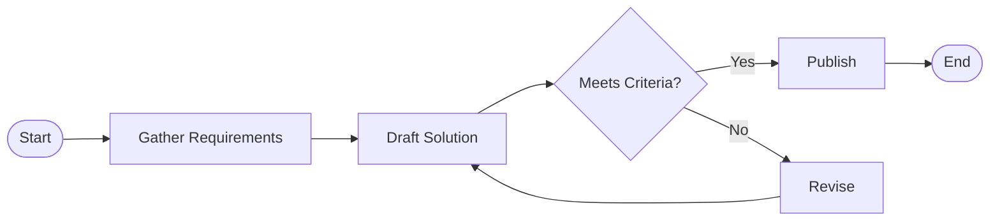

# Are you still struggling?

This is a cool flow diagram I can generate.

```mermaid
flowchart LR
A([Start]) --> B[Gather Requirements]
B --> C[Draft Solution]
C --> D{Meets Criteria?}
D -- Yes --> E[Publish]
D -- No --> F[Revise]
F --> C
E --> G([End])
```

